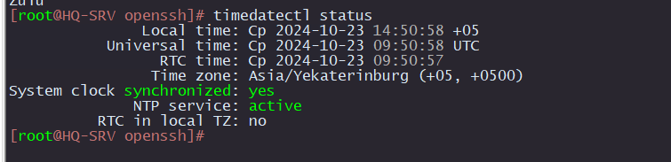

# Настройка часового пояса

## HQ-SRV, HQ-CLI, BR-SRV

Проверяем какой часовой пояс установлен

```
timedatectl status
```



Если отличается, то устанавливаем

```
timedatectl set-timezone Asia/Yekaterinburg
```

## HQ-RTR, BR-RTR (EcoRouter)

```
conf t
ntp timezone utc+5
```
Проверяем:

```
show ntp timezone
```
